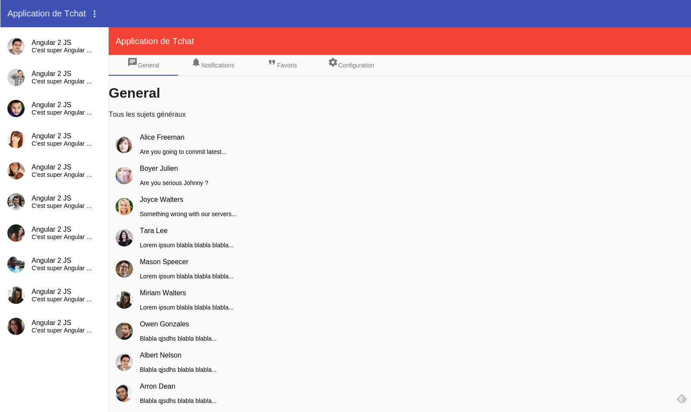

# IsoTchat Project

### Webpack + Angular2 + Angular CLI

Simple Application for Angular2 with Webpack :




### Demo on Firebase

[https://tchat-cabb3.firebaseapp.com/](https://tchat-cabb3.firebaseapp.com/)


### Deploy on Firebase

```
    ng build --prod 
    firebase login
    firebase deploy
```

### Features:

* Firebase API (options)
* Server Side Render https://github.com/vladotesanovic/angular2-express-slim
* Build basic Angular App with Webpack & HMR
* Theme Material Design & Angular Design
* VSCode settings
* TSLint & TSDoc
* Sass support
* Angular Material Design
* Angular Google Map in Directive
* Typescript Support
* Sourcemap support
* Types Nodes or Typings Deps for TypeScript


### Specs


+ Colonne qui Liste des users
+ Tchat au Centre
+ Personne online/offline
+ Jetter un Wizz(son)
+ Liens photo
+ Search: rechercher des message
+ Supprimer des conversations
+ Ecrire un message (140 car max)+ heure + personne
+ Partie Setting pour le nb de message, nb de users
+ Map des users pour les messages


#### Some Snippets by John Papa

## TypeScript Snippets

* ng2-bootstrap       // Angular 2 bootstrapping, for main.ts
* ng2-component       // Angular 2 component
* ng2-component-root  // Angular 2 root app component
* ng2-http-get        // Angular 2 http.get with Rx Observable
* ng2-module          // Angular 2 module
* ng2-module-root     // Angular 2 root app module
* ng2-pipe            // Angular 2 pipe
* ng2-routing         // Angular 2 routing
* ng2-service         // Angular 2 service
* ng2-subscribe       // Angular 2 Rx Observable subscription


## HTML Snippets fpr Directives

* ng2-ngClass
* ng2-ngFor
* ng2-ngIf
* ng2-ngModel
* ng2-routerLink
* ng2-ngStyle
* ng2-ngSwitch


### All Angular components

[https://github.com/angular/material2#feature-status](All Material Angular2 Components)


### API Docs

[https://angular.io/docs/ts/latest/api/](https://angular.io/docs/ts/latest/api/)


### Use Angular CLI
https://github.com/angular/angular-cli#generating-components-directives-pipes-and-services 

### Some helps


This project was generated with [angular-cli](https://github.com/angular/angular-cli) version 1.0.0-beta.21.

## Development server
Run `ng serve` for a dev server. Navigate to `http://localhost:4200/`. The app will automatically reload if you change any of the source files.

## Code scaffolding

Run `ng generate component component-name` to generate a new component. You can also use `ng generate directive/pipe/service/class`.

## Build

Run `ng build` to build the project. The build artifacts will be stored in the `dist/` directory. Use the `-prod` flag for a production build.

## Running unit tests

Run `ng test` to execute the unit tests via [Karma](https://karma-runner.github.io).

## Running end-to-end tests

Run `ng e2e` to execute the end-to-end tests via [Protractor](http://www.protractortest.org/).
Before running the tests make sure you are serving the app via `ng serve`.

## Deploying to Github Pages

Run `ng github-pages:deploy` to deploy to Github Pages.

## Further help

To get more help on the `angular-cli` use `ng --help` or go check out the [Angular-CLI README](https://github.com/angular/angular-cli/blob/master/README.md).
